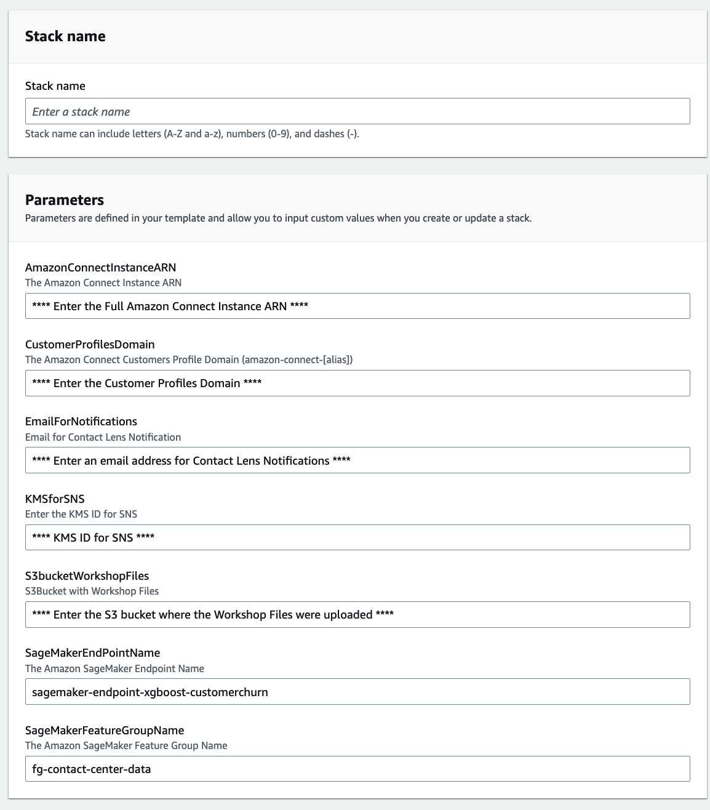

# AWS Workshop How to Retain Your Customers with AI-powered Contact Centers

This workshop contains instructions to build a real-time customer churn prediction pipeline for contact centers using Amazon connect and Amazon SageMaker services.

## Architecture

The following is the architecture diagram for the "Real-Time churn prediction with Amazon Connect and Amazon SageMaker".

 

## Deployment

### Prerequisites

Users need to be familiar with the below AWS services:

- Amazon SageMaker
- Amazon Connect
- AWS Lambda
- AWS Step Functions
- Amazon API Gateway
- Amazon S3 and CloudFront

Note that this workshop is designed for instructor led lab, where the SageMaker Feature Store is already setup for you. If you run the lab using personal account without an existing SageMaker Feature Store, please use the cloudformation function `LambdaZipCFN.yaml` in the Cloudformation-SageMaker-FS folder to setup the feature group used in the workshop. The workshop is expected to run in **us-west-2** region.
### Amazon SageMaker

Clone the [github repo](https://github.com/aws-samples/aws-workshop-how-to-retain-your-customers-with-ai-powered-contact-centers.git) into SageMaker Studio. 

#### Model Build Pipeline

1. Build the churn model using SageMaker Pipeline
- Go through the steps defined in the Jupyter notebook [demo_customer_churn_pipeline.ipynb](https://github.com/aws-samples/aws-workshop-how-to-retain-your-customers-with-ai-powered-contact-centers/blob/main/demo_customer_churn_pipeline.ipynb). This notebook will create a SageMaker Pipeline to create the machine learning model for real-time churn prediction. A complete build pipeline looks like below:


2. Deploy the model from model registry after the SageMaker pipeline execution is finished by following the instructions in the juypter notebook.

Once the SageMaker real-time endpoint is ready, move on to the next section to build the contact center using Amazon Connect.

### Contact Lens for Amazon Connect and Customer Profiles

This solution requires:

- An existing Amazon Connect instance with Contact Lens for Amazon Connect and Customer Profiles enabled
- Contact Flows enabled for "Real-Time and post call analytics" in the "Set recording and analytics behavior"
- Create one (1) Real-time Contact Lens Rules with a "Sentiment - Time period" from the "Customer" for negative sentiments for the past 1 minute of the contact


- Assign a contact category called LongNegativeSentiment
- Add an action "Generate an EventBridge event" and "CreateTask" using the same name of the category


### AWS CloudFormation Stack

#### Create a S3Bucket and Upload files in the WorkshopFiles folder

There are three (3) files in the [WorkshopFiles folder](./Cloudformation-Serverless-Connect/WorkshopFiles/), these are Layers for [Pandas](https://pandas.pydata.org/) and [Numpy](https://numpy.org/):
- WorhshopFiles/pandas/python.zip
- WorkshopFiles/numpy/python.zip
- WorkshopFiles/reInvent2022-LexBot-DRAFT-RATIIENAXZ-LexJson.zip

The CloudFormation stack [reInvent2022-BIZ310-Serveless-v4.yaml](./Cloudformation-Serverless-Connect/reInvent2022-BIZ310-Serverless-v4.yaml), in the cloudformation folder, will create all the serverless applications required for the solution. The input parameters of the CloudFormation stack include Amazon Connect ARN, Amazon Connect Instance, Amazon SageMaker Endpoint name, and Amazon SageMaker Feature Group Name.



### Amazon Connect

The CustomerProfiles lambda function needs to be added to the list of AWS lambda functions that the Amazon Connect instance has permission to access. This is done in the AWS Console > Amazon Connect > Contact Flows > AWS Lambda. Use the Lambda function in your contact flow with the "Invoke AWS Lambda function" block.

### Amazon DynamoDB

Three (3) DynamoDB tables will be created by the CloudFormation stack, ContactIds, ChurnPrediction, and Sentiments.

### Amazon S3 and CloudFront

Create an Amazon S3 bucket and a CloudFront distribution with that S3 bucket as the origin. Use CCPcustom.html as the default root object.

Update the Approved origins in the AWS Management Console > Amazon Connect adding the new created Cloudfront URL.


### Agent Custom CCP

To build the Agent Custom CCP upload the files in the website folder, update the CCPcustom.html with the following information:

- Line 80 - ```var instanceURL = "***ADD your Amazon Connect CCP v2 URL***"```
- Line 97 - ```replace region with your AWS region```
- Line 185 - ```"url": "***apiGatewayInvokeURLchurn URL - Output of CloudFormation***"```
- Line 395 - ```"url": "***apiGatewayInvokeURLcontract URL - Output of CloudFormation***"```

The website will look as below:


## Clean Up

Following these steps to clean up the project:

- Use the Clean Up cell in the demo customer churn pipeline notebook to clean up resources created in the model build process
- Delete the SageMaker project from the SageMaker project console, this will delete the code pipeline, but cloudformation templates and repositories created using this project will need to be manually deleted
- CloudFormation, delete the stack created as part of the process above
- CloudFront, delete the distribution
- S3, delete the bucket used to store the files of the website
- Amazon Connect, disable Contact Lens in the Contact Flows enabled at the start of the project


## Security

See [CONTRIBUTING](CONTRIBUTING.md#security-issue-notifications) for more information.

## License

This library is licensed under the MIT-0 License. See the LICENSE file.

